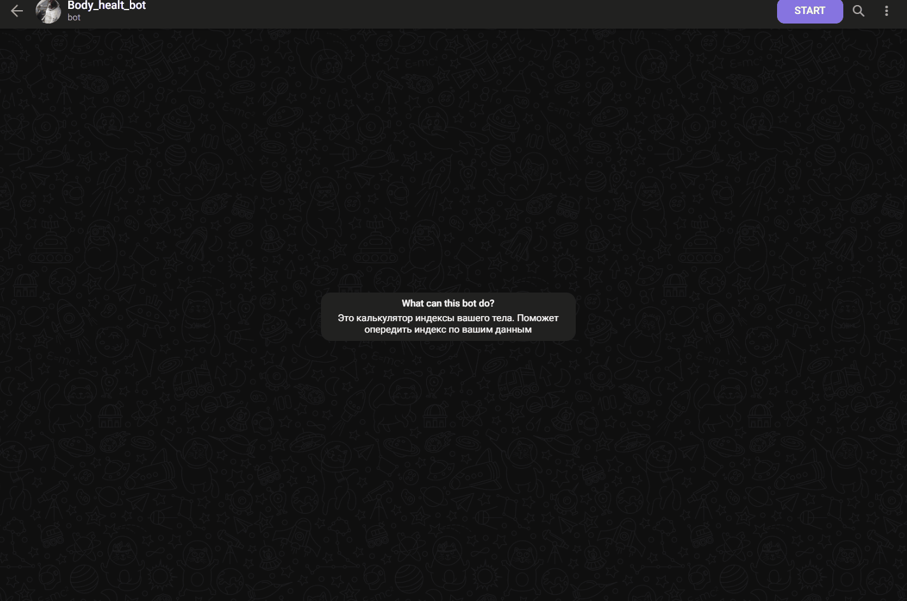

# Проект "В здоровом теле"

## Описание проекта
Данный проект создан для помощи пользователю в определении своего ИМТ.

## Цели проекта
Помочь пользователю определить уровень его ИМТ.

## Используемые технологии
Для работы проекта вам необходимо установить Python3.
Для работы с проектом рекомендуеться использовать Visual Studio Code.
Для работы с проектом вам так же понадобится мессенджер Telegram.


## Установка зависимостей
Загрузите на компьютер необходимые файлы, затем используйте `pip` для установки зависимостей и установить зависимости. Зависимости можно установить командой, представленной ниже.
Установите зависимости командой:
```
pip install -r requirements.txt
```
Для создания своего бота вам следует обратится к специальному боту в Telegram  @BotFather.
Для создания бота необходимо нажать кнопку /start после чего ввести команду /newbot.
BotFather предложит ввести название нового бота. Можно использовать русские буквы. Название бота будет отображаться в шапке бота.
После выбора названия чат-бота будет предложено создать для него имя пользователя для аккаунта. По этому имени можно будет найти бота в поиске и создать ссылку на бота. Имя пользователя для аккаунта должно быть на английском языке. В конце обязательно должно быть слово bot.
После чего в папке с проектом вам нужно создать файл .env и заполнить его следующим образом
```
TOKEN = "".
```
В кавычках вы должны указать совой токен. Он выглядит примерно так: ``6557693824:AAEQpzfgihClHiuhtteA3Y7CWP8WdDGBAwxc``
## Пример запуска




Проект выполнен в образовательных целях на онлайн-курсе "Основы Python" школы "Лидер".